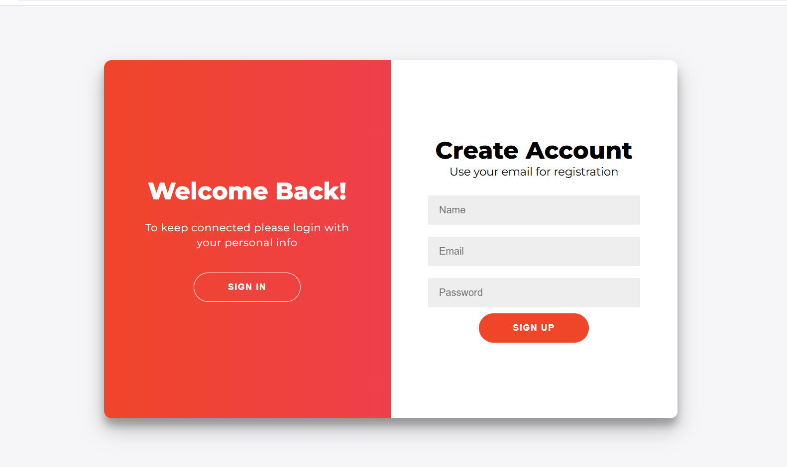

# OIBSIP_Level2_Task4
# 🔐 Modern Auth System

A modern, responsive, and clean authentication interface built using **HTML**, **CSS**, and **JavaScript**. It features user registration, login, localStorage-based session management, and simulated social login options.

## ✨ Features

- 👤 **User Registration & Login**  
  Input validation, error messages, and session handling with `localStorage`.

- 🔄 **Form Toggle**  
  Seamless switch between Login and Signup forms.

- 🌐 **Social Login UI**  
  Google, GitHub, and Apple login buttons (frontend only).

- 📱 **Responsive Design**  
  Fully mobile-friendly with a clean modern look.
-  🗃️ **LocalStorage** for session simulation
  

## 🛠️ Tech Stack

- **Frontend**: HTML5, CSS3 (custom, responsive)
- **JavaScript**: Vanilla JS (DOM manipulation, validation, storage)
- **Icons**: Font Awesome CDN

## 🖼️ Preview

> 

