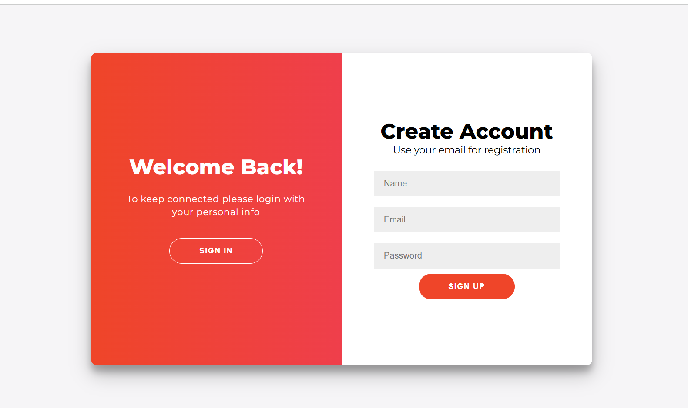

# OIBSIP_Level2_Task4
# 🔐 Responsive Auth System - Login & Registration Form

This project is a **Responsive Authentication System** implemented using **HTML**, **CSS**, and **JavaScript**. It provides a modern and intuitive interface for user **login** and **registration**, featuring localStorage-based data handling and animated transitions.

## 🚀 Features

- ✅ **Responsive Design** – Fits perfectly on all screen sizes.
- ✅ **Login & Sign-up Forms** – Separate panels for logging in and creating an account.
- ✅ **Stylish Transitions** – Smooth animated transitions between login and signup forms.
- ✅ **Client-side Validation** – Checks for empty input fields and duplicate users.
- ✅ **LocalStorage Integration** – Stores user data and simulates authentication without a backend.
- ✅ **Success & Error Alerts** – Dynamic alert messages for user feedback.

## 🛠️ Technologies Used

- **HTML5** – Markup for structuring the UI.
- **CSS3** – For styling, layout, and animations.
- **JavaScript (Vanilla)** – DOM manipulation, localStorage operations, and form handling.

## 🖼️ Preview

> 
